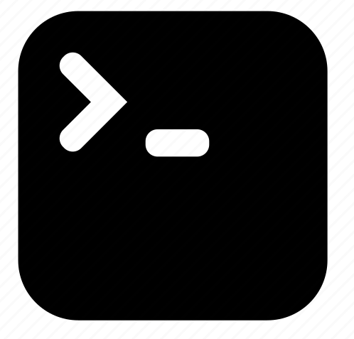

### Hi there , I'm Rao Ali - AKA [rootxRAN]  👋
### I am a Cyber Security student and developer
<!--
**raoalinawaz-cys/raoalinawaz-cys** is a ✨ _special_ ✨ repository because its `README.md` (this file) appears on your GitHub profile.

Here are some ideas to get you started:

- 🌱 I’m currently learning ...
- 👯 I’m looking to collaborate on ...
- 🤔 I’m looking for help with ...
- 💬 Ask me about ...
- 📫 How to reach me: ...
- 😄 Pronouns: ...
- ⚡ Fun fact: ...
-->

- 🔭 I’m currently working on Web Application Security
<!-- languages -->
### Languages and Tools:
<section>
   
  

  
</section>
  

<!-- linux -->
### Linux:
<section>
   
  

</section>

